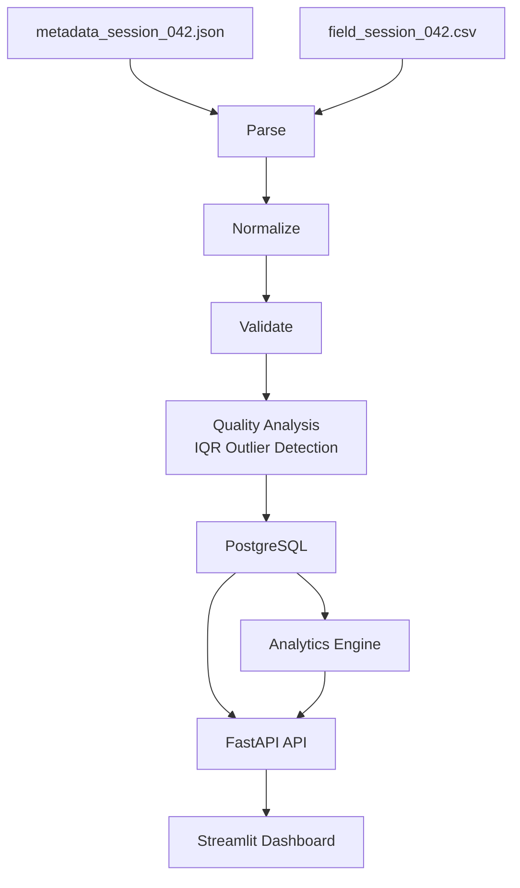

# Field Test Ingestion & Analytics

A local prototype built for the Corractions home assignment.

The system ingests a field-test driving session, handles real-world data quality issues, stores the processed data in PostgreSQL, and presents driving behavior insights through a Streamlit dashboard.

---

# Assignment Scope

The challenge provides a single sample session:

```text
sample-data/
├── field_session_042.csv
└── metadata_session_042.json
```

This project is intentionally scoped to the provided dataset.

It is **not** a production platform, generic ingestion engine, or large-scale analytics system.

The focus is to demonstrate:

* Data ingestion
* Data normalization
* Data validation
* Data quality analysis
* Analytics generation
* Data visualization

---

# Features

## Data Ingestion

* Read metadata from JSON
* Read measurements from CSV
* Validate required fields
* Normalize timestamps, numbers, and boolean values
* Preserve original raw values for review

## Data Quality

* Missing field detection
* Invalid numeric value detection
* Range validation
* Sensor error marker detection (`ERROR_TIMEOUT`)
* Statistical outlier detection using IQR

## Data Persistence

* Store session metadata
* Store all measurements
* Store validation results
* Store outlier flags

## Analytics

* Driving behavior metrics
* Steering variability
* Speed variability
* Turning behavior analysis
* Reverse-driving analysis
* Speed-steering correlation
* Generated reviewer insights

## Dashboard

* Session information
* Driver behavior insights
* Data quality summary
* Validation breakdown
* Driving visualizations
* Problem row inspection
* Raw measurement review

---

# Running Locally

Start the complete stack:

```bash
docker compose up --build
```

Services:

| Service             | URL                   |
| ------------------- | --------------------- |
| Backend API         | http://localhost:8000 |
| Streamlit Dashboard | http://localhost:8501 |
| PostgreSQL          | localhost:5432        |

---

# Automatic Data Import

When the backend starts:

1. Alembic migrations are applied.
2. The sample session is imported automatically.
3. Duplicate imports are skipped.

No manual import step is required.

---

# System Pipeline

The application follows a simple and explicit processing pipeline:

```text
Metadata JSON
+
CSV Measurements
        │
        ▼
   Parse Files
        │
        ▼
 Normalize Data
        │
        ▼
 Validate Measurements
        │
        ▼
 Detect Outliers (IQR)
        │
        ▼
 Store in PostgreSQL
        │
        ▼
 Generate Analytics
        │
        ▼
 Build Dashboard Response
        │
        ▼
 Streamlit Dashboard
```

---

# Architecture



---

# Project Structure

```text
backend/
├── api/                 FastAPI routes
├── db/                  SQLAlchemy models and Alembic migrations
├── validation/          Validation rules and models
├── analytics.py         Driving behavior analytics
├── quality.py           Data quality analysis and IQR outlier detection
├── ingestion.py         Metadata parsing, CSV parsing, normalization
├── import_flow.py       End-to-end ingestion workflow
└── seed_sample_data.py  Sample data importer

frontend/
├── dashboard.py         Streamlit application entry point
├── dashboard/
│   ├── sections.py      Dashboard layout and rendering
│   ├── data.py          Dashboard calculations
│   ├── charts.py        Chart creation helpers
│   ├── client.py        Backend API communication
│   └── helpers.py       Formatting and utility helpers

sample-data/
├── field_session_042.csv
└── metadata_session_042.json

docker-compose.yml
README.md
```

---

# Why This Technology Stack

## PostgreSQL

Sessions and measurements are naturally relational data.

PostgreSQL provides:

* Simple persistence
* Easy querying
* Strong typing
* Clear interview discussion

---

## FastAPI

FastAPI provides:

* Typed API contracts
* Simple route definitions
* Easy integration with Pydantic models
* Lightweight backend architecture

---

## Streamlit

Streamlit allows rapid creation of reviewer-facing dashboards without building a separate frontend application.

This makes it ideal for a time-boxed prototype.

---

## Docker Compose

Docker Compose allows the entire system to run using a single command.

This makes review and evaluation straightforward.

---

# Backend

The backend is responsible for ingestion, validation, persistence, analytics, and API responses.

## ingestion.py

Responsible for:

* Metadata parsing
* CSV parsing
* Data normalization

---

## validation/

Responsible for:

* Required field validation
* Numeric validation
* Range validation
* Sensor error marker validation

---

## quality.py

Responsible for:

* Statistical outlier detection
* Data quality reporting

Outliers are detected using the Interquartile Range (IQR) method.

Forward-driving and reverse-driving measurements are analyzed separately to avoid false outlier classifications.

---

## analytics.py

Responsible for generating driving behavior analytics such as:

* Steering variability
* Speed variability
* Turning behavior
* Reverse-driving behavior
* Speed-steering correlation
* Reviewer insights

---

## import_flow.py

Coordinates the complete import workflow:

```text
Parse
→ Normalize
→ Validate
→ Detect Outliers
→ Persist
```

---

## db/

Contains:

* SQLAlchemy models
* Database session setup
* Alembic migrations

---

## api/

Provides dashboard-facing API endpoints.

---

# Frontend

The frontend is implemented using Streamlit.

Its responsibility is presentation only.

All ingestion, validation, quality analysis, and analytics calculations happen in the backend.

The frontend consumes the dashboard API response and renders the results for review.

---

## Session Information

Displays session metadata and recording context.

Examples:

* Session ID
* Vehicle ID
* Recording date
* Test location
* Hardware version
* Active sensors

---

## Driver Behavior Insights

Highlights key driving metrics:

* Steering variability
* Speed variability
* Turning measurements
* Sharp turn measurements
* Reverse-driving metrics
* Speed-steering correlation

---

## Data Quality

Displays:

* Total rows
* Valid rows
* Invalid rows
* Outlier rows
* Sensor error markers

---

## Validation Breakdown

Explains why measurements failed validation.

Examples:

* Missing values
* Invalid numeric values
* Range violations
* Sensor errors

---

## Driving Visualization

Includes:

* Speed Across Session
* Wheel Angle Across Session
* Speed vs Steering Angle
* Turning vs Straight Driving comparison

---

## Problem Rows

Displays:

* Invalid measurements
* Outlier measurements
* Validation messages
* Raw values
* Normalized values

This allows reviewers to quickly understand data quality issues.

---

## Raw Measurements

Displays the processed measurements used by the dashboard.

---

# Data Quality Handling

The sample data intentionally includes real-world quality issues.

The system detects:

## Missing Required Fields

Examples:

```text
timestamp
speed
wheel_angle
```

---

## Invalid Numeric Values

Examples:

```text
abc
xyz
```

where numeric values are expected.

---

## Range Violations

### Speed

```text
0 <= speed <= 200
```

### Wheel Angle

```text
-45 <= wheel_angle <= 45
```

---

## Sensor Error Markers

Examples:

```text
ERROR_TIMEOUT
```

These are reported explicitly rather than treated as generic validation failures.

---

## Statistical Outliers

Outliers are detected using IQR.

Only valid measurements participate in outlier analysis.

Outliers remain visible for reviewer inspection.

---

# Analytics

The backend generates analytics from valid, non-outlier measurements.

## Driving Stability

* Steering variability
* Speed variability

## Turning Behavior

* Turning measurements
* Sharp turn measurements
* Average speed while turning
* Average speed while driving straight

## Reverse Driving

* Reverse percentage
* Reverse measurement count
* Average reverse speed

## Driving Relationships

* Speed-steering correlation

## Reviewer Insights

Short observations generated from calculated metrics.

Examples:

```text
No sharp turn measurements were detected.

Reverse driving accounted for 16% of analyzed measurements.

No strong relationship was observed between steering intensity and speed.
```

---

# API Overview

Primary endpoints:

```http
GET /api/v1/health

GET /api/v1/sessions

GET /api/v1/sessions/{id}/dashboard
```

The dashboard endpoint provides:

* Session metadata
* Quality report
* Analytics
* Measurements

in a single response.

---

# Scaling Considerations

If this prototype were expanded beyond the assignment:

* Background import jobs
* Chunked CSV processing
* Session pagination
* Dashboard chart downsampling
* Authentication
* Structured logging
* Monitoring and observability
* Retryable import workflows

These improvements were intentionally left out to keep the assignment focused and easy to review.

---

# Future Improvements

Possible next steps:

* Manual file upload endpoint
* Session filtering and pagination
* Larger dataset support
* Authentication and authorization
* Operational monitoring
* Advanced analytics

---
