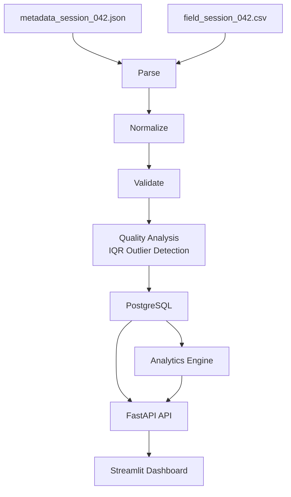

# Field Test Ingestion & Analytics

A local prototype built for the Corractions home assignment.

The system ingests a field-test driving session, handles real-world data quality issues, stores the processed data in PostgreSQL, and presents driving behavior insights through a Streamlit dashboard.

---

# Assignment Scope

The challenge provides a single sample session:

```text
sample-data/
├── field_session_042.csv
└── metadata_session_042.json
```

This project is intentionally scoped to the provided dataset.

It is **not** a production platform, generic ingestion engine, or large-scale analytics system.

The focus is to demonstrate:

* Data ingestion
* Data normalization
* Data validation
* Data quality analysis
* Analytics generation
* Data visualization

---

# Features

## Data Ingestion

* Read metadata from JSON
* Read measurements from CSV
* Validate required fields
* Normalize timestamps, numbers, and boolean values
* Capture offending CSV values in validation errors at import time

## Data Quality

* Missing field detection
* Invalid numeric value detection
* Range validation
* Sensor error marker detection (`ERROR_TIMEOUT`)
* Statistical outlier detection using IQR

## Data Persistence

* Store session metadata
* Store all measurements
* Store validation results
* Store outlier flags

## Analytics

* Driving behavior metrics
* Steering variability
* Speed variability
* Turning behavior analysis
* Reverse-driving analysis
* Speed-steering correlation
* Steering bucket analysis (average speed by steering intensity)
* Generated reviewer insights

## Dashboard

* Session information
* Driver behavior insights
* Data quality summary
* Validation breakdown
* Driving visualizations
* Problem row inspection
* Raw measurement review

---

# Running Locally

Start the complete stack:

```bash
docker compose up --build
```

Services:

| Service             | URL                   |
| ------------------- | --------------------- |
| Backend API         | http://localhost:8000 |
| Streamlit Dashboard | http://localhost:8501 |
| PostgreSQL          | localhost:5432        |

---

# Automatic Data Import

When the backend starts:

1. Database tables are created and the sample session is seeded during FastAPI startup.
2. Duplicate imports are skipped.

No manual import step is required.

Analytics are **not** computed at import time. They are generated on demand when the dashboard API is called.

---

# System Pipeline

The application follows a simple and explicit processing pipeline:

```text
Metadata JSON
+
CSV Measurements
        │
        ▼
   Parse Files
        │
        ▼
 Normalize Data
        │
        ▼
 Validate Measurements
        │
        ▼
 Quality Analysis (IQR Outlier Detection)
        │
        ▼
 Store in PostgreSQL
        │
        ▼
 Generate Analytics (on dashboard request)
        │
        ▼
 Build Dashboard API Response
        │
        ▼
 Streamlit Dashboard
```

Import workflow (`import_flow.py`):

```text
Parse → Normalize → Validate → Quality → Persist
```

---

# Architecture



Quality analysis and analytics are separate backend modules. Quality handles outlier detection and quality reporting. Analytics handles driving behavior metrics and insights.

---

# Project Structure

```text
backend/
├── src/
│   ├── main.py                    FastAPI application entry point
│   ├── api/
│   │   └── routes/                Health and session API routes
│   ├── db/                        SQLAlchemy models and database setup
│   ├── validation/
│   │   ├── measurement_validator.py
│   │   └── models.py              Validation rules, constants, and result models
│   ├── analytics/                 Driving behavior analytics (orchestration, metrics, insights)
│   ├── quality/
│   │   ├── outlier_detection.py
│   │   ├── quality_report.py
│   │   └── models.py              Data quality report models
│   ├── ingestion/
│   │   ├── parsers.py             Metadata and CSV parsing
│   │   └── normalizer.py          Measurement normalization
│   ├── schemas/
│   │   ├── analytics_schemas.py   Analytics API response models
│   │   └── dashboard_schemas.py   Dashboard and measurement response models
│   ├── import_flow.py             End-to-end ingestion workflow
│   └── seed_sample_data.py        Sample data importer
├── requirements.txt
└── Dockerfile

frontend/
├── src/
│   ├── dashboard.py               Streamlit application entry point
│   ├── api_client.py              Backend API communication
│   └── dashboard/
│       ├── sections.py            Dashboard layout and rendering
│       ├── data.py                Table and display formatting
│       ├── chart_data.py          API-to-chart DataFrame mapping
│       ├── charts.py              Chart creation helpers
│       └── helpers.py             Formatting and utility helpers
├── Dockerfile
└── .dockerignore

sample-data/
├── field_session_042.csv
└── metadata_session_042.json

docker-compose.yml
README.md
```

---

# Why This Technology Stack

## PostgreSQL

Sessions and measurements are naturally relational data.

PostgreSQL provides:

* Simple persistence
* Easy querying
* Strong typing
* Clear interview discussion

---

## FastAPI

FastAPI provides:

* Typed API contracts
* Simple route definitions
* Easy integration with Pydantic models
* Lightweight backend architecture

---

## Streamlit

Streamlit allows rapid creation of reviewer-facing dashboards without building a separate frontend application.

This makes it ideal for a time-boxed prototype.

---

## Docker Compose

Docker Compose allows the entire system to run using a single command.

This makes review and evaluation straightforward.

---

# Backend

The backend is responsible for ingestion, validation, persistence, analytics, and API responses.

## ingestion/

Responsible for:

* Metadata parsing (`parse_metadata`)
* CSV parsing (`parse_csv`)
* Data normalization (`normalize_measurements`)

---

## validation/

Responsible for:

* Required field validation
* Numeric validation
* Range validation
* Sensor error marker validation

Validation rules and constants live in `validation/models.py`. The validator applies them without mutating normalized measurements.

---

## quality/

Responsible for:

* Statistical outlier detection (`DataQualityAnalyzer`)
* Data quality reporting (`DataQualityReporter`)

Outliers are detected using the Interquartile Range (IQR) method.

Forward-driving and reverse-driving measurements are analyzed separately to avoid false outlier classifications.

---

## analytics/

Responsible for generating driving behavior analytics such as:

* Steering variability
* Speed variability
* Turning behavior
* Reverse-driving behavior
* Speed-steering correlation
* Steering bucket analysis
* Reviewer insights

Modules:

* `calculator.py` — orchestration only; partitions measurements and assembles the analytics response
* `statistics.py` — basic statistics and forward timeline series
* `driving_behavior.py` — driver behavior metrics, steering bucket analysis, and speed-steering correlation in a single forward-metrics pass
* `insights.py` — text interpretation for `drivingInsights` and steering bucket chart captions

---

## import_flow.py

Coordinates the complete import workflow:

```text
Parse
→ Normalize
→ Validate
→ Quality
→ Persist
```

---

## db/

Contains:

* SQLAlchemy models
* Database session setup
* `initialize_database()` — creates tables via `Base.metadata.create_all()`

---

## api/

Provides dashboard-facing API endpoints via `api/routes/`:

* `health_routes.py` — health check
* `session_routes.py` — sessions, dashboard, and measurements

---

# Frontend

The frontend is implemented using Streamlit.

Its responsibility is **presentation only**.

All ingestion, validation, quality analysis, and analytics calculations happen in the backend.

The frontend consumes the dashboard API response and renders the results for review.

The frontend:

* Renders charts, tables, and metric cards
* Formats display values
* Maps API responses to chart-ready DataFrames

The frontend does **not**:

* Calculate analytics metrics
* Build driving insights
* Aggregate measurements for analysis
* Calculate correlations
* Create steering buckets

The only lightweight display calculation is a timeline mean used as a reference line on the wheel-angle chart (`mean_from_timeline`).

---

## Session Information

Displays session metadata and recording context.

Examples:

* Session ID
* Vehicle ID
* Recording date
* Test location
* Hardware version
* Active sensors

---

## Driver Behavior Insights

Metrics and observations are split by drive direction:

**Forward Driving** (primary control analysis):

* Steering variability
* Speed variability
* Turning measurements
* Sharp turn measurements
* Speed-steering correlation

**Reverse Driving** (context):

* Reverse measurement count and percentage
* Average reverse speed
* Reverse steering variability

Key observations in the insights card are generated in the backend and returned as `drivingInsights`.

---

## Data Quality

Displays:

* Total rows
* Valid rows
* Invalid rows
* Outlier rows
* Sensor error markers

---

## Validation Breakdown

Explains why measurements failed validation.

Examples:

* Missing values
* Invalid numeric values
* Range violations
* Sensor errors

---

## Driving Visualization

**Timeline charts** use the pre-computed backend series (`forwardDriving.timeline`):

* Speed Across Session (forward only)
* Wheel Angle Across Session (forward only)

**Steering bucket chart** uses backend bucket analysis (`forwardDriving.steeringBucketAnalysis`):

* Average Speed by Steering Intensity (forward only; vertical bar chart)
* Chart caption uses the backend-generated bucket insight
* Y-axis is scaled to the data range, not zero, so bucket differences are visible

**Forward vs Reverse:**

* Forward vs Reverse comparison — grouped bars for average speed and steering variability

The frontend maps API responses to charts without recomputing analytics.

---

## Problem Rows

Displays:

* Invalid measurements
* Outlier measurements
* Validation messages (including raw offending values where relevant)
* Normalized values

This allows reviewers to quickly understand data quality issues.

---

## Raw Measurements

Displays the normalized measurements used by the dashboard (not original CSV strings).

---

# Data Quality Handling

The sample data intentionally includes real-world quality issues.

The system detects:

## Missing Required Fields

Examples:

```text
timestamp
speed
wheel_angle
```

---

## Invalid Numeric Values

Examples:

```text
abc
xyz
```

where numeric values are expected.

---

## Range Violations

### Speed

```text
0 <= speed <= 200
```

### Wheel Angle

```text
-45 <= wheel_angle <= 45
```

---

## Sensor Error Markers

Examples:

```text
ERROR_TIMEOUT
```

These are reported explicitly rather than treated as generic validation failures.

---

## Statistical Outliers

Outliers are detected using IQR.

Only valid measurements participate in outlier analysis.

Outliers remain visible for reviewer inspection.

---

# Analytics

The backend generates analytics from valid, non-outlier measurements when the dashboard endpoint is called.

## Driving Stability

* Steering variability
* Speed variability

## Turning Behavior

* Turning measurements
* Sharp turn measurements
* Average speed while turning
* Average speed while driving straight

## Reverse Driving

* Reverse percentage
* Reverse measurement count
* Average reverse speed

## Driving Relationships

* Speed-steering correlation
* Steering bucket analysis — average speed grouped by absolute wheel-angle ranges:
  * `0-5°`, `5-10°`, `10-15°`, `15-20°`, `20-25°`, `25°+`

## Reviewer Insights

Short observations generated from calculated metrics and returned as `drivingInsights`.

Examples:

```text
Forward steering behavior remained relatively stable throughout the session.

8 sharp turn measurements were detected during forward driving.

No clear relationship between speed and steering intensity.

Reverse driving represented 16% of analyzed measurements.
```

Steering bucket chart captions are generated separately in `steeringBucketAnalysis.insight`, for example:

```text
Average speed decreased as steering intensity increased.
```

---

# API Overview

Primary endpoints:

```http
GET /api/v1/health

GET /api/v1/sessions

GET /api/v1/sessions/{id}/dashboard

GET /api/v1/sessions/{id}/measurements
```

The dashboard endpoint provides:

* Session metadata
* Quality report (`qualityReport`)
* Analytics (`forwardDriving`, `reverseDriving`, `drivingInsights`)

The measurements endpoint provides the full measurement list for tables.

## Analytics Response Shape

`forwardDriving` includes metrics, correlation, steering bucket analysis, and timeline series:

```json
{
  "speedMean": 58.2,
  "steeringVariability": 12.4,
  "speedVariability": 8.1,
  "totalTurns": 23,
  "sharpTurns": 8,
  "averageSpeedDuringTurns": 58.5,
  "averageSpeedDuringStraightDriving": 59.1,
  "speedSteeringCorrelation": -0.052,
  "steeringBucketAnalysis": {
    "buckets": [
      {
        "label": "0-5°",
        "averageSpeed": 56.8,
        "measurementCount": 10
      },
      {
        "label": "5-10°",
        "averageSpeed": 60.0,
        "measurementCount": 10
      }
    ],
    "insight": "Average speed decreased as steering intensity increased."
  },
  "timeline": [
    {
      "rowIndex": 0,
      "speed": 51.0,
      "wheelAngle": -2.8
    }
  ]
}
```

`reverseDriving` includes measurement count, percentage, average speed, and steering variability.

`drivingInsights` is a list of backend-generated observation strings.

---

# Scaling Considerations

If this prototype were expanded beyond the assignment:

* Background import jobs
* Chunked CSV processing
* Session pagination
* Dashboard chart downsampling
* Authentication
* Structured logging
* Monitoring and observability
* Retryable import workflows

These improvements were intentionally left out to keep the assignment focused and easy to review.

---

# Future Improvements

Possible next steps:

* Manual file upload endpoint
* Session filtering and pagination
* Larger dataset support
* Authentication and authorization
* Operational monitoring
* Advanced analytics

---
