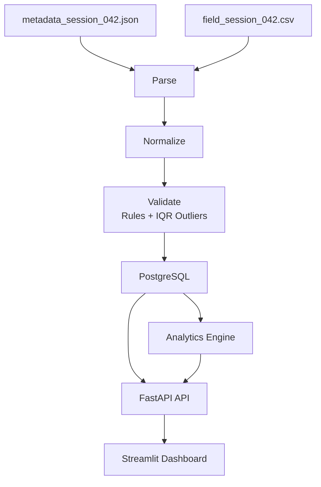

# Field Test Ingestion & Analytics

A local prototype built for the Corractions home assignment.

The system ingests a field-test driving session, handles real-world data quality issues, stores the processed data in PostgreSQL, and presents driving behavior insights through a Streamlit dashboard.

---

# Assignment Scope

The challenge provides a single sample session:

```text
sample-data/
├── field_session_042.csv
└── metadata_session_042.json
```

This project is scoped to that dataset — a prototype, not a production ingestion platform.

It demonstrates ingestion, normalization, validation, quality analysis, analytics, and visualization.

---

# Running Locally

Start the complete stack:

```bash
docker compose up --build
```

| Service             | URL                   |
| ------------------- | --------------------- |
| Backend API         | http://localhost:8000 |
| Streamlit Dashboard | http://localhost:8501 |
| PostgreSQL          | localhost:5432        |

On startup, the backend creates database tables and seeds the sample session. Duplicate imports are skipped.

Analytics are **not** computed at import time. They are generated on demand when the dashboard API is called.

If the database schema changed (e.g. after model updates), reset the volume:

```bash
docker compose down -v && docker compose up --build
```

---

# Architecture

Import workflow (`import_flow.py`):

```text
Parse → Normalize → Validate (rules + IQR outliers) → Persist
```

Dashboard request path:

```text
PostgreSQL → Analytics Engine → FastAPI → Streamlit
```



Validation (rule checks and IQR outlier detection at import), quality reporting (dashboard aggregation), and analytics (driving metrics, insights) are separate backend modules.

---

# Project Structure

```text
backend/
├── src/
│   ├── main.py                    FastAPI application entry point
│   ├── api/
│   │   └── routes/                Health and session API routes
│   ├── db/                        SQLAlchemy models and database setup
│   ├── validation/
│   │   ├── measurement_validator.py
│   │   ├── outlier_detection.py   IQR outlier detection on valid rows
│   │   └── models.py              Validation rules, constants, and result models
│   ├── analytics/                 Driving behavior analytics (orchestration, metrics, insights)
│   ├── quality/
│   │   ├── quality_report.py
│   │   └── models.py              Data quality report models
│   ├── ingestion/
│   │   ├── parsers.py             Metadata and CSV parsing
│   │   └── normalizer.py          Measurement normalization
│   ├── schemas/
│   │   ├── analytics_schemas.py   Analytics API response models
│   │   └── dashboard_schemas.py   Dashboard and measurement response models
│   ├── import_flow.py             End-to-end ingestion workflow
│   └── seed_sample_data.py        Sample data importer
├── requirements.txt
└── Dockerfile

frontend/
├── src/
│   ├── dashboard.py               Streamlit application entry point
│   ├── api_client.py              Backend API communication
│   └── dashboard/
│       ├── sections.py            Dashboard layout and rendering
│       ├── data.py                Table and display formatting
│       ├── chart_data.py          API-to-chart DataFrame mapping
│       ├── charts.py              Chart creation helpers
│       └── helpers.py             Formatting and utility helpers
├── Dockerfile
└── .dockerignore

sample-data/
├── field_session_042.csv
└── metadata_session_042.json

docker-compose.yml
README.md
```

---

# Technology Choices

**PostgreSQL** — Sessions and measurements are relational. PostgreSQL gives simple persistence, typed columns, and straightforward querying for a reviewable prototype.

**FastAPI** — Typed routes and Pydantic schemas define a clear API contract between backend and dashboard.

**Streamlit** — Rapid reviewer-facing UI without building a separate frontend app; fits a time-boxed assignment.

**Docker Compose** — Single command to spin up backend, database, and dashboard for evaluation.

---

# Backend Modules

| Module | Responsibility |
| ------ | -------------- |
| `ingestion/` | Parse metadata JSON and CSV; normalize timestamps, numbers, and booleans |
| `validation/` | Apply business rules, IQR outlier detection on valid rows; attach `validation_errors` per row |
| `quality/` | Aggregate persisted measurements into dashboard quality report |
| `analytics/` | Driving metrics, correlation, steering bucket analysis, timeline series, text insights |
| `import_flow.py` | Orchestrates parse → normalize → validate → persist in one transaction |
| `db/` | SQLAlchemy models; session metadata stored as JSONB |
| `api/routes/` | Health check, session list, dashboard payload, raw measurements |

**Analytics modules:** `calculator.py` (orchestration), `driving_behavior.py` (forward metrics + buckets + correlation), `statistics.py` (timeline series), `insights.py` (reviewer-facing text).

Analytics run on **valid, non-outlier** measurements. Forward and reverse gear are analyzed separately for outliers and metrics.

### Validation and quality rules

| Check | Rule |
| ----- | ---- |
| Required fields | `timestamp`, `speed`, `wheel_angle` must be present |
| Numeric | `speed`, `wheel_angle` must parse when a value is provided |
| Speed range | `0 <= speed <= 200` |
| Wheel angle range | `-45 <= wheel_angle <= 45` |
| Sensor marker | `ERROR_TIMEOUT` in any raw field → explicit invalid-marker error |
| Outliers | IQR on valid rows only; forward and reverse analyzed separately |

Invalid rows and outliers remain stored and visible in the dashboard problem-rows table.

### Analytics output (high level)

- **Forward driving:** steering/speed variability, turn counts, speed-steering correlation, steering bucket analysis (average speed by wheel-angle intensity), timeline series
- **Reverse driving:** measurement count, percentage, average speed, steering variability
- **Insights:** backend-generated strings in `drivingInsights`; bucket chart caption in `steeringBucketAnalysis.insight`

Example insight: *"Forward steering behavior remained relatively stable throughout the session."*

---

# Frontend

Presentation only — all ingestion, validation, quality analysis, and analytics run in the backend.

The dashboard consumes the session dashboard API and renders:

- Session metadata
- Driver behavior insights and metric cards
- Data quality summary and validation breakdown
- Timeline charts (speed, wheel angle) from `forwardDriving.timeline`
- Average speed by steering intensity (vertical bar chart from `steeringBucketAnalysis`)
- Forward vs reverse comparison
- Problem rows (invalid + outlier measurements with validation messages)
- Normalized measurement table

The only client-side calculation is a timeline mean used as a reference line on the wheel-angle chart.

---

# API

```http
GET /api/v1/health
GET /api/v1/sessions
GET /api/v1/sessions/{id}/dashboard
GET /api/v1/sessions/{id}/measurements
```

**Dashboard response** includes:

- Session metadata
- `qualityReport` — row counts, invalid-by-rule, missing-by-field, sensor errors
- `forwardDriving` — metrics, `speedSteeringCorrelation`, `steeringBucketAnalysis` (`buckets`, `insight`), `timeline`
- `reverseDriving` — count, percentage, average speed, steering variability
- `drivingInsights` — list of observation strings

**Measurements response** — full measurement list for tables (`rowIndex`, normalized values, `isValid`, `isOutlier`, `validationErrors`).

---

# Scaling and Next Steps

If this grew from one file to thousands of longer sessions:

- Background import jobs and retryable workflows
- Chunked CSV streaming instead of loading entire files in memory
- Session pagination and filtering on list endpoints
- Dashboard chart downsampling for very long timelines
- Authentication and authorization
- Structured logging, monitoring, and observability

---
